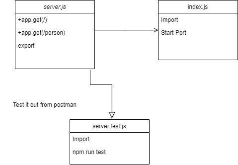

# basic-express-server

## LAB - 02

### Deployment Test

**Author: Laith-Hayajneh**

- [tests report](https://github.com/Laith-Hayajneh/basic-express-server/actions).
**Herok**
- [back-end](https://basic-express2.herokuapp.com/).
- [pull request](https://github.com/Laith-Hayajneh/basic-express-server/pull/1).

**Setup**

`.env` **requirements**

- `PORT` - Port Number

**Running the app**

- `npm start`

- Endpoint: `/person?name=Tariq`

  - Returns Object

        {
        "name": "Laith",
        }

**Tests**

- Unit Tests: `npm run test`

**UML**

